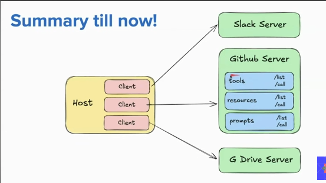

- What is MCP Servers

  - The Why
  - The What
  - The How

- PS : News Letter on mail - Get daily

  - Own Newslettter
    - Solve the problem of making newsletter which can be sent by mail using MCP

- First how the Newsletter should look like must be clear

  - Introduction
  - Big story of the week
  - 3-5 Quick Updates
  - Top Research Papers
  - 1 Quick tutorial
  - Top Ai products of the week
  - Top X posts
  - Closing notes

- Clearly definig thow and what should look like the newsletter cause it will be donen by AI

  - Research Notes
  - Editing
  - Designing

- Tools

  - Claude Chatbot
  - Web search
  - Github
  - Google Drive
  - Gmail
  - Product Hunt

- The Why
  - Context Context is everything an Ai can see when it generates a response
  - There is no single source of context from where ai can get the context

Example :

- Let say a software engineer was assigned a task to impletement 2 factor authentication in a web app
  Steps:
  - He checks his jira tickets for what exactly is required
  - He checks his company documentation and codebase for any existing implementation
  - He checks slack channels for any discussions within the team
  - He can search on google for 2 factor authentication implementation
  - He can check github for some open source projects
- All these sources are context for the software engineer to complete his task
- Similarly an AI needs context from multiple sources to generate a good response

  - Currently there is no single platform which can provide context from multiple sources to an AI

- If Engineer have to implement 2FA via AI
  - He has to manually provide context from multiple sources to the AI
  - This is time consuming and inefficient because copy pasting from multiple sources is tedious just to create context for AI
  - In a way the Human just became API for the AI to get context from multiple sources just to complete a simple task

Problem :

- Time for Context Gathering >> Time for Task Completion

- Solution : MCP Servers

  - MCP Servers will provide a platform where multiple context sources can be connected to provide context to AI for task completion
  - Just like how API servers provide data to applications, MCP servers will provide context to AI for task completion
  - This will reduce the time for context gathering and increase the efficiency of AI in task completion

- MCP have two main components

  - MCP Client
  - MCP Server

- MCP Client

  - MCP Client will be the chatbot interface where user can interact with the AI models
  - User will provide the task to be completed via MCP Client

- MCP Server

  - MCP Server will be responsible for aggregating the context from multiple sources and providing it to the AI models for task completion.

- Why MCP is booming

  - Ai needs context from multiple sources to generate good responses and other tools need to make their MCP servers to provide context to AI

- MCP Architecture using first principles

  - Host -> Ai chatbot(could be owned or 3rd party like claude, chatgpt etc)

  - Server -> MCP Server (could be of slack, github, google drive, gmail, web search etc)

- Flow :
  Let say user asks the chatbot "Are there any new commits on my github repo ?"

  - User -> Host(Ai Chatbot) -> MCP Server (Github) -> Github API -> Commits Data -> MCP Server -> Host(Ai Chatbot) -> User

Here MCP server of github gave the context of commits data to the Ai chatbot to answer the user query

In reality Host (Ai chatbot ) never direclty talks to server host asks to client about query in high level then client converts it to mcp compatible query and sends it to MCP Server which then fetches data from the source and converts it to a language model compatible format and sends it back to Host via MCP client

Host can connect to multiple MCP servers but for host to connect to multiple MCP servers it needs to have multiple MCP clients

Client and MCP server has one to one mapping

Benefits of This Architecture

- Scalability : New MCP servers can be added easily without affecting the existing architecture
- Decoupling : Host and MCP servers are decoupled which allows independent development and deployment
- Flexibility : Host can connect to multiple MCP servers to get context from multiple sources

-Primitives [Things that server offer to host via client]

- Tools (Actions that host can perform via server)
- Resources (Structured Data that host can access via server)
- Prompts (Predefined queries that host can use via servers offers to shape ai behavior)

Example : How Prompt Premotives looks like for Github MCP Server

{
"name": "issue_report_prompt",
"description": "Prompt to generate a report of open issues in a github repository",
"message": [
{
"role": "system",
"content": "You are a helpful assistant that generates reports of open issues in a github repository."
},
{
"role": "user",
"content": "Always include : Title, Steps to reproduce, Expected, Actual behavior, Labels, Assignee, Environment details"
}
],
}

Primitives- Standard Operations

Tools :

- tools/list - List all available tools in the MCP server
- tools/call - Client tells server - Please perform this action with these parameters

Resources :

- resources/list - List all available resources in the MCP server
- resources/read - Client says - "Give me the content of this resource with these parameters"
- resources/subscribe/unsubscribe - Client subscribes or unsubscribes to resource updates"

Prompts :

- prompts/list - List all available prompts in the MCP server
- prompt/use - Client fetches a specific prompt template from the MCP server to use in host-AI interactions

MCP Data Layer -

- Data Layer is the language and grammar of the MCP ecosystem that everyone agrees upon to communicate.

In MCP, JSON RPC 2.0 serves as the foundation of the data layer, providing a structured and standardized way for different components to interact seamlessly.

JSON RPC 2.0 is a remote procedure call (RPC) protocol encoded in JSON.

A Remote Procedure Call (RPC) allows a program to execute a function on another computer as if it were a local, hiding the details of the network communication and data transfer. This abstraction makes it easier to build distributed systems.

Example: instead of writing add(2,3) locally, you send request to the server saying "Please execute add(2,3) on my behalf" and server returns the result 5.

JSON RPC combines the concept of remote with the simplicity of json allowing developers to structure requests and responses in a standardized json format.

Example JSON RPC:

- Request:
  {
  "jsonrpc": "2.0",
  "method": "add",
  "params": [2, 3],
  "id": 1
  }

- Response (if successful):
  {
  "jsonrpc": "2.0",
  "result": 5,
  "id": 1
  }

- Response (if error):
  {
  "jsonrpc": "2.0",
  "error": {
  "code": -32601,
  "message": "Method not found"
  },
  "id": 1
  }

Lets see in different senarios how requests and responses look like in MCP ecosystem using JSON RPC 2.0

1. Discovering Available Tools
   Request:
   {
   "jsonrpc": "2.0",
   "method": "tools/list",
   "params": {},
   "id": 1
   }

Response:
{
"jsonrpc": "2.0",
"result": [
{
"name": "create_issue",
"description": "Create a new issue in the repository",
"parameters": {
"title": "string",
"description": "string"
}
},
{
"name": "list_issues",
"description": "List all open issues in the repository",
"parameters": {}
}
],
"id": 1
}

2. Calling a Tool
   Request:
   {
   "jsonrpc": "2.0",
   "method": "tools/call",
   "params": {
   "tool_name": "create_issue",
   "parameters": {
   "title": "Bug in login feature",
   "description": "Users are unable to log in using social media accounts."
   }
   },
   "id": 2
   }

   Response:
   {
   "jsonrpc": "2.0",
   "result": {
   "issue_id": 123,
   "status": "created"
   },
   "id": 2
   }

3. Listing Available Resources
   Request:
   {
   "jsonrpc": "2.0",
   "method": "resources/list",
   "params": {},
   "id": 3
   }

   Response:
   {
   "jsonrpc": "2.0",
   "result": [
   {
   "name": "repository_info",
   "description": "Information about the repository"
   },
   {
   "name": "commit_history",
   "description": "List of recent commits in the repository"
   }
   ],
   "id": 3
   }

4. Reading a Resource
   Request:
   {
   "jsonrpc": "2.0",
   "method": "resources/read",
   "params": {
   "resource_name": "repository_info"
   },
   "id": 4
   }
   Response:
   {
   "jsonrpc": "2.0",
   "result": {
   "name": "MyRepo",
   "owner": "User123",
   "created_at": "2023-01-01T12:00:00Z
   },
   "id": 4
   }

5. Batching Multiple Requests [Request multiple operations in a single call]
   Request:
   [
   {
   "jsonrpc": "2.0",
   "method": "tools/list",
   "params": {},
   "id": 5
   },
   {
   "jsonrpc": "2.0",
   "method": "resources/list",
   "params": {},
   "id": 6
   }
   ]

   Response:
   [
   {
   "jsonrpc": "2.0",
   "result": [
   {
   "name": "create_issue",
   "description": "Create a new issue in the repository",
   "parameters": {
   "title": "string",
   "description": "string"
   }
   },
   {
   "name": "list_issues",
   "description": "List all open issues in the repository",
   "parameters": {}
   }
   ],
   "id": 5
   },
   {
   "jsonrpc": "2.0",
   "result": [
   {
   "name": "repository_info",
   "description": "Information about the repository"
   },
   {
   "name": "commit_history",
   "description": "List of recent commits in the repository"
   }
   ],
   "id": 6
   }
   ]

   6. Notification (fire and forget - no response expected)
      Request:
      {
      "jsonrpc": "2.0",
      "method": "file/updated",
      "params": {
      "file_path": "/path/to/updated/file.txt",
      "name": "Alice",
      "updated_by": "alice@example.com",
      "timestamp": "2023-01-01T12:00:00Z"
      }
      }
      Response:
      (No response expected)
